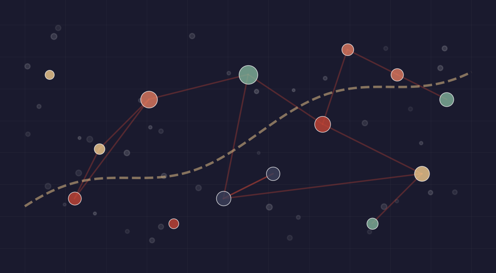

::: {.jm-banner}
**On the 2026–27 academic job market** &nbsp; [Job Market Paper](jobmarket.qmd){.jm-btn} [CV](cv.qmd){.jm-btn}
:::

::: {.contact}
<span style="color:#a33a2a;">
<i class="bi bi-envelope-fill"></i>
</span>
[juan.zurita@ed.ac.uk](mailto:juan.zurita@ed.ac.uk)
<!-- 📧 [juan.zurita@ed.ac.uk](mailto:juan.zurita@ed.ac.uk) -->
<!-- 🐙 [GitHub](https://github.com/Juanignaciozurita) -->
<!-- 📄 [CV](https://drive.google.com/file/d/1DlbczDUbWkBIWiaEBQGoVwmb0AAtj5Dn/view) -->
:::


## Research Interest
Macroeconomics


####  <span style="color:#b22222;">Welcome to my personal website</span>

<p style="text-align: justify;">
I am a Fix-Term Lecturer in Economics at the School of Economics at the University of Edinburgh. My research focuses on macroeconomic policy and credit markets. My work combines theoretical frameworks with empirical analysis to better understand the interplay between credit supply and demand and the macroeconomy.
</p>

::: {.statement-frame}

::: {.columns}

::: {.column width="50%"}
## [Research Statement](files/Research_Statement - Juan Zurita - 2026.pdf)
:::

::: {.column width="50%"}
## [Teaching Statement](files/Juan Zurita Teaching Statement - 2026.pdf)
:::

:::

:::


## Research Highlights
::: {.justified-list}
- **July 2026**: Job Market Paper: ["*Who Bears the Burden of Bank Capital Regulation? Buffers, Risk Weights, and the Supply of Credit*"](jobmarket.qmd) — new draft circulated
- **May 2026**: My paper ["*Does Household Debt affect the Transmission Mechanism of Monetary Policy*"](https://drive.google.com/file/d/1vWuFSW6Wn0GZTiBAaC-48kA-jwidCV2u/view?usp=sharing) has been published in _Macroeconomic Dynamics_
- **March 2026**: New Working Paper: ["*The Bank Profit Channel of Monetary Policy*"](https://drive.google.com/file/d/1diD_WeOjfIid2flkEFpJnEuftlgbH2H8/view?usp=sharing) with Jiening Le
- **February 2026**: My project [“*Productivity Growth and the Fiscal Sustainability Programme in the United Kingdom*”](https://drive.google.com/file/d/1JgVkmJzz4pxLuUIiWGliRyAgdT616lJh/view?usp=sharing) has received funding from the Royal Society of Edinburgh.
- **January 2026**: My paper [*Banking Heterogeneity, Credit Supply and Economic Growth*](https://doi.org/10.1016/j.iref.2026.104921) ([Slides](https://drive.google.com/file/d/1Dby9pZ6fk5J3uGjtT9oqn7JmWJp9CwQq/view?usp=sharing)) has been published at the International Review of Economics and Finance.
:::


## Explore My Work

```{=html}
<div class="homepage-cards">
<a href="research.html" class="homepage-card">
<div class="homepage-card-img">

</div>
<div class="homepage-card-body">
<h3>Research</h3>
<p>Macroeconomic policy, credit markets, household debt, and banking — publications, working papers, and an interactive explorer.</p>
</div>
</a>
<a href="teaching.html" class="homepage-card">
<div class="homepage-card-img">

</div>
<div class="homepage-card-body">
<h3>Teaching</h3>
<p>Open course materials in Programming &amp; Numerical Methods and Deep Learning for Macroeconomics — interactive notebooks and Colab links.</p>
</div>
</a>
<a href="consulting.html" class="homepage-card">
<div class="homepage-card-img">

</div>
<div class="homepage-card-body">
<h3>Consulting &amp; Policy</h3>
<p>Applied research for central banks, regulators, and government — fiscal sustainability, macro modelling, and data strategy.</p>
</div>
</a>
</div>
```


